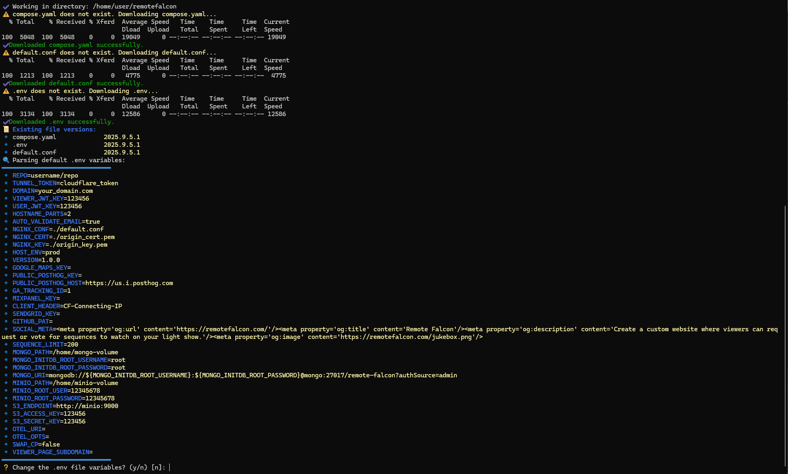

# cloudflared-remotefalcon

> Compatibility work in this workspace targets the current
> [Remote Falcon platform monorepo](https://github.com/Remote-Falcon/remote-falcon-platform).
> The original Ne0n09 repositories were archived on May 29, 2026. The
> `image-builder/` directory contains an updated copy of the GitHub Actions
> template; copy its workflow into your private builder repository before
> using GitHub image builds. Existing deployments should back up MongoDB and
> their `.env` before changing images, then run `./health_check.sh` after the
> update. The stack was validated on Debian 13 with Docker Compose 5.5.1 on
> September 18, 2026.

For a new checkout, keep the bundled files together and copy
`remotefalcon/.env.example` to `remotefalcon/.env` before configuration. The
installer no longer downloads missing files from the archived repository.

[cloudflared-remotefalcon](https://github.com/Ne0n09/cloudflared-remotefalcon/tree/main) helps you self host [Remote Falcon](https://remotefalcon.com/) through guided setup and configuration using [Cloudflare Tunnels](https://developers.cloudflare.com/cloudflare-one/connections/connect-networks/) and your own server capable of running [Docker](https://www.docker.com/) through the use of various helper [scripts](https://ne0n09.github.io/cloudflared-remotefalcon/about/scripts/).

For full details check the [cloudflared-remotefalcon documentation](https://ne0n09.github.io/cloudflared-remotefalcon/)!

To learn more about [Remote Falcon](https://remotefalcon.com/) check out the documentation [here](https://docs.remotefalcon.com/).

Installation is a three-step process, although step 2 is optional:

1. [Cloudflare](https://ne0n09.github.io/cloudflared-remotefalcon/install/cloudflare/)

2. [GitHub](https://ne0n09.github.io/cloudflared-remotefalcon/install/github/)

3. [Remote Falcon](https://ne0n09.github.io/cloudflared-remotefalcon/install/remotefalcon/)

You may refer to the [release notes](https://ne0n09.github.io/cloudflared-remotefalcon/release-notes/) for any updates to the scripts and files.

## configure-rf demo

