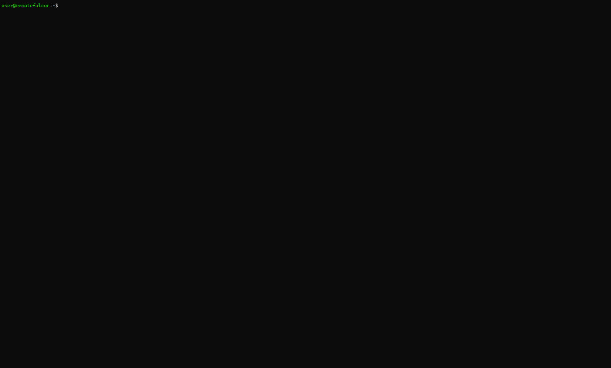
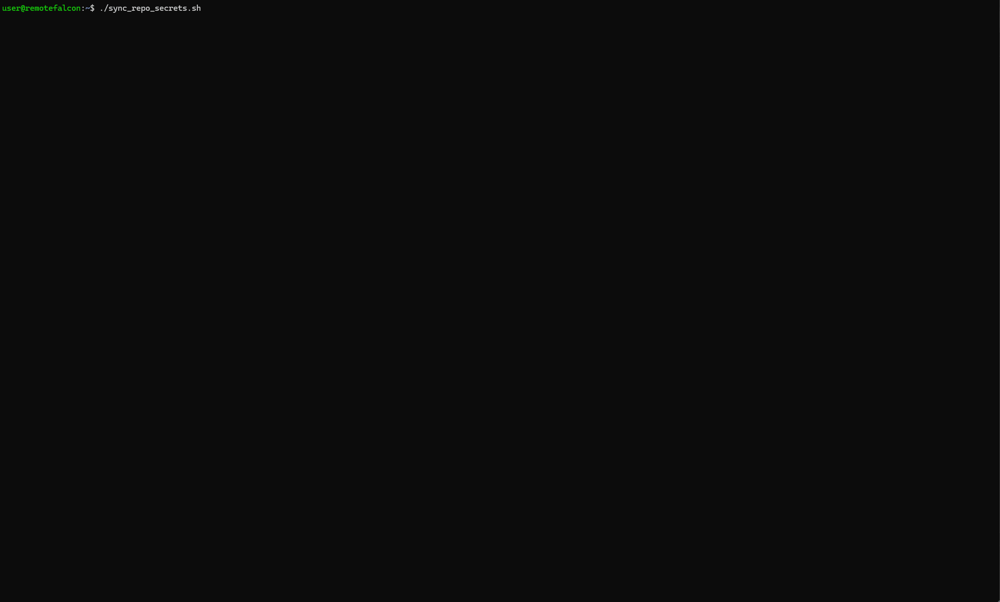
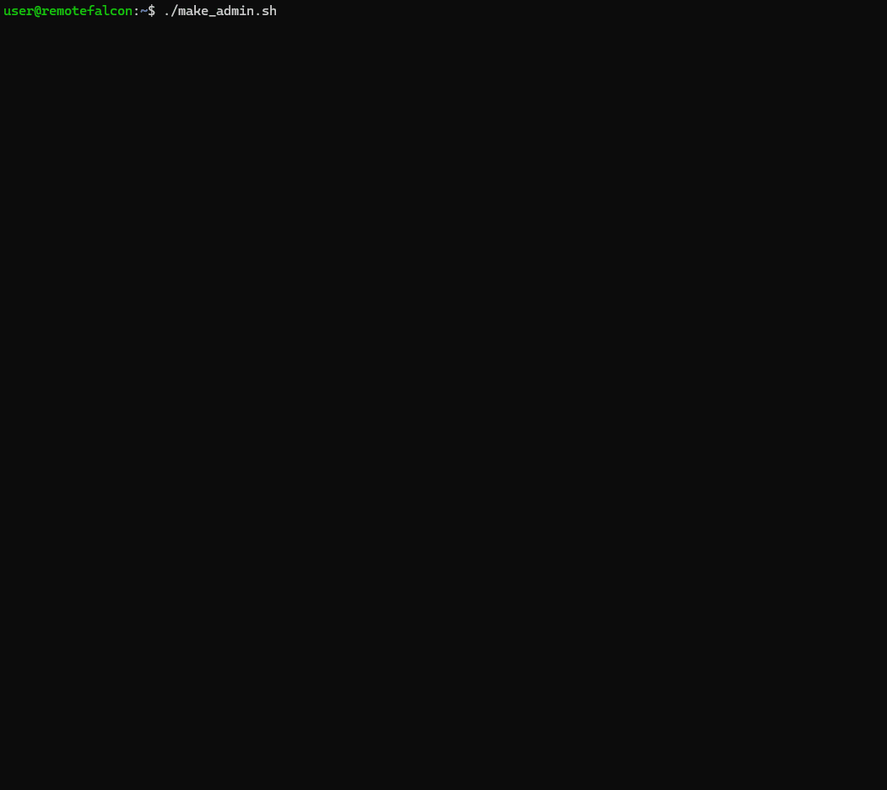

Click the name of the script to expand the section to display details about the script.

??? example "configure-rf.sh"

    #### configure-rf.sh

    - Used for the initial setup and configuration of [cloudflared-remotefalcon](https://github.com/Ne0n09/cloudflared-remotefalcon/tree/main).

    - Guides through setting the required and some optional [.env](files.md#env) variables.

    - Can be re-run to view or update the variables or to run the container update or health check scripts.

    - Requires the helper scripts from this checkout.

    - Automatically creates the `remotefalcon` and `remotefalcon-backups` directories.

    - Uses local compose.yaml and default.conf; creates .env from .env.example if needed.

    - Can be run interactively(defualt) or non-interactively for a more automated setup.


    ```sh title="Run configure-rf.sh"
    ./configure-rf.sh
    ./configure-rf.sh -y|--non-interactive      Run non-interactively (no prompts)"
    ./configure-rf.sh --set KEY=VALUE           Set configuration override for config questions(can be used multiple times)"
    ./configure-rf.sh -h, --help                Shows usage help "
    ```

    Store credentials in the private `remotefalcon/.env` file or enter them at the interactive prompts. Avoid putting tokens in shell arguments.

    ```sh title="Run configuration"
    ./configure-rf.sh
    # For scripted runs, fill in .env first, then use:
    ./configure-rf.sh -y --set DOMAIN=YOURDOMAIN.COM
    ```

    

??? example "update_containers.sh"

    #### update_containers.sh

    - Checks for updates and updates non-RF containers to their latest available release.

    - Checks for updates and updates Remote Falcon containers to the latest available commit on the [Remote Falcon Github](https://github.com/Remote-Falcon).

    - The [compose.yaml](files.md#composeyaml) build context hash is updated to the latest commit for the Remote Falcon containers.
    
    - The compose.yaml container image tag is updated to the latest release.

    - A backup of the compose.yaml is created when any of the containers are updated.

    - The image tag for the Remote Falcon container is updated in the compose.yaml to the short-hash:
    ```yaml linenums="50" hl_lines="3 6"
      plugins-api:
        build:
          context: https://github.com/Remote-Falcon/remote-falcon-platform.git#cc1593aab27dc195a4c55b5b1410ddc06e96a60c
          dockerfile: apps/plugins-api/Dockerfile
          args:
            - OTEL_OPTS=${OTEL_OPTS}
        image: plugins-api:cc1593a
        container_name: plugins-api
    ```

    - Accepts three arguments:

        1. `[all|mongo|versitygw|nginx|cloudflared|plugins-api|control-panel|viewer|ui|external-api]`

            - `container_name`: You can specify an individual container or all. If left blank with no other arguments it will check all containers in interactive mode.

        2. `[dry-run|auto-apply|interactive]`: 

            - `dry-run`: Displays if any updates are available or if up to date.

            - `auto-apply`: Automatically update all RF containers if any updates are found.

            - `interactive/no argument`: Display if update is available and prompt for confirmation before updating each container.

        3. `[health]`

            - Each upgraded container is health checked automatically. The optional legacy `health` argument remains accepted without triggering a full-stack check.

    ```sh title="update_containers script syntax examples" 
    ./update_containers.sh [all|mongo|versitygw|nginx|cloudflared|plugins-api|control-panel|viewer|ui|external-api] [dry-run|auto-apply|interactive] [health]
    ./update_containers.sh
    ./update_containers.sh all dry-run health
    ./update_containers.sh all auto-apply
    ```
    

??? example "health_check.sh"

    #### health_check.sh

    - Performs a 'health check' of various things and displays any issues that are found.

    - Checks if containers are running.

    - Checks Remote Falcon endpoints.

    - Checks if the domain is not the default.

    - Checks if the [.env](files.md#env) file exists.

    - Checks if the Cloudflare Origin certificate and key exist and if they match.

    - Checks NGINX configuration and tests it.

    - Checks various Versity Gateway configuration details for Image Hosting.

    - Checks Mongo to search for any shows that are configured and provides their URL.

    - Checks if [SWAP_CP](../post-install.md#swap-viewer-page-subomdain) is enabled and displays the Control Panel URL.

    - Checks for any known issues by checking container logs directly.

    ```sh title="Run health_check.sh" 
    ./health_check.sh
    ```

    To check only one container immediately, run `./health_check.sh 0s plugins-api` (replace `plugins-api` with another service name). Omitting the service checks all containers.

    

??? example "sync_repo_secrets.sh"

    #### sync_repo_secrets.sh

    - If [REPO](files.md#env) and [GITHUB_PAT](files.md#env) are configured in the .env file this script will sync the build arguments required to build images with GitHub Actions.

    ```sh title="Run sync_repo_secrets.sh" 
    ./sync_repo_secrets.sh
    ```

    

??? example "run_workflow.sh"

    #### run_workflow.sh

    - If [REPO](files.md#env) and [GITHUB_PAT](files.md#env) are configured in the .env file this script will run a GitHub Actions workflow to build new Remote Falcon Images.
    
    - It will call the sync_repo_secrets script to ensure build arguments are synced prior to building new images.

    - If building all images, expect the workflow to run for about 15 minutes.

    ```sh title="run_workflow script syntax examples" 
    # Usage:./run_workflow.sh [ container | container=sha | container=sha container=sha ...]
    ./run_workflow.sh # Runs the build.yml GitHub Actions workflow to build all containers to the latest available commit.
    ./run_workflow.sh [container] # Runs the build.yml GitHub Actions workflow to build an individual container to the latest available commit on 'main'.
    ./run_workflow.sh [container=sha] # Runs the build.yml GitHub Actions workflow to build an individual container to a specific commit SHA.
    ./run_workflow.sh plugins-api=69c0c53 control-panel=671bbed viewer=060011d ui=245c529 external-api=f7e09fe # Runs the build.yml GitHub Actions workflow to build all containers to the specified commit SHAs.
    ```

    

??? example "generate_jwt.sh"

    #### generate_jwt.sh

    - This is to be able to make use of the External API.

    - Assists with getting your API access token and secret key from your Remote Falcon show in the MongoDB database without having Sendgrid configured for email. 

    - Then the script generates a JWT for you to use.

    The script is included in this checkout.

    ```sh title="Run generate_jwt.sh"
    ./generate_jwt.sh
    ```

    

??? example "make_admin.sh"

    #### make_admin.sh

    - This script will display shows that have admin access and allow you to toggle admin access when the show subdomain is passed as an argument.

    - Run the script with no arguments to display currently configured showRole(USER/ADMIN).

    - This basically lets you see and edit MongoDB information from within Remote Falcon.

    The script is included in this checkout.

    ```sh title="Run make_admin.sh"
    ./make_admin.sh
    ```

    

??? example "versitygw_init.sh"

    #### versitygw_init.sh

    - This script will configure Versity Gateway. Versity Gateway is an object storage server.

    - The script is called when 'configure-rf.sh' is run and if certain default values are found in the .env file for a hands-off setup and configuration.

    - The versitygw container is configured for local direct access to the control-panel container.

    - This lets you use the Image Hosting tab in the Control Panel which allows you to self host your viewer page images.

    - The script can be run again manually with no ill-effects to ensure Versity Gateway is configured properly.

    - If the legacy `/home/minio-volume` directory and its `remote-falcon-images.minio` container are found, the script automatically mirrors the old image bucket into Versity Gateway. It verifies object paths and sizes, stops the retired MinIO container, and renames the old volume to a dated `.migrated-*` backup instead of deleting it.

    - The script is automatically downloaded by configure-rf.

??? example "shared_functions.sh"

    #### shared_functions.sh

    - This is a helper script for functions and variables that are re-used across the other scripts. 

??? example "setup_cloudflare.sh"

    #### setup_cloudflare.sh

    - This is a script to automatically set up Cloudflare domain, certificate, SSL/TLS, tunnel, and DNS settings.

    - This script is intended for new installations, but can be re-run to ensure settings are correct, create new certificates, and to delete and re-create the tunnel and tunnel settings.

    - The script will ask you for your Cloudflare API token.

    - The Cloudflare API token is not stored.

    - The script can be run non-interactively or arguments passed:

    ```sh title="setup_cloudflare script syntax examples" 
    # Usage:./setup_cloudflare.sh [ -y|--non-interactive | --domain <domain> | --api-token <token> ]
    ./setup_cloudflare.sh -y --domain yourdomain.com --api-token your_CF_API_TOKEN # Runs the script to automatically configure Cloudflare without any prompting.
    ```
