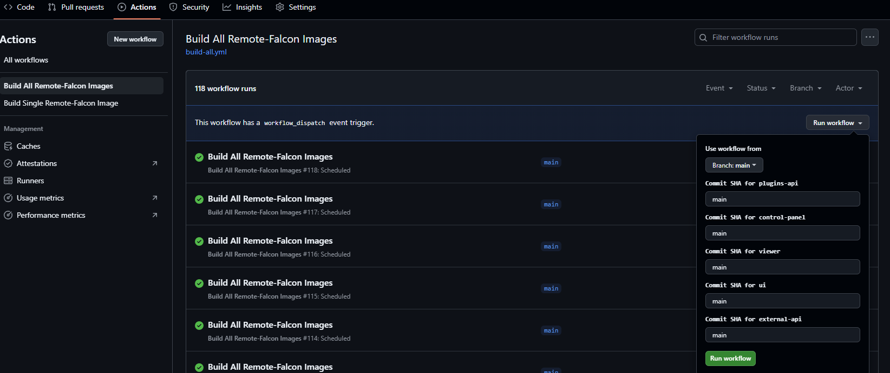
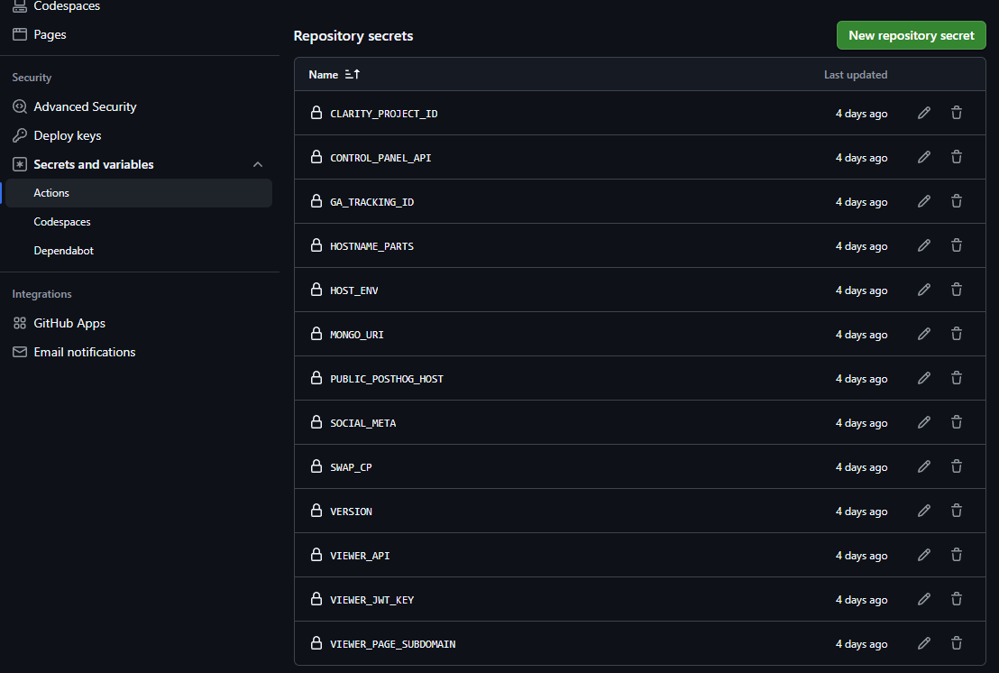

If you configured GitHub during the configure-rf script then you will have a private repository created from the[remote-falcon-image-builder](https://github.com/Ne0n09/remote-falcon-image-builder) template repository.

- The repository will have two workflows.

- The workflows can be run manually on GitHub under Actions:

## build-all.yml

- The [build-all.yml](https://github.com/Ne0n09/remote-falcon-image-builder/blob/main/.github/workflows/build-all.yml) will build all Remote Falcon images on GitHub and push them to your private GitHub Container Registry to allow for easy updates.

- The workflow runs daily at 11:00 PM Central Time to check for any new updates from the RF repositories.

## build-container.yml

- the [build-container.yml](https://github.com/Ne0n09/mlightsdevtest/blob/main/.github/workflows/build-container.yml) workflow is intended to build a single Remote Falcon image if a manual update is performed and the image does not already exist in GHCR.

## Secrets

- The workflows utilize secrets stored under your repository.

- The [sync_repo_secrets](scripts.md#sync_repo_secretssh) script will automatically sync the repo secrets.

- You can manually update the secrets under Settings -> Secrets and variables -> Actions:

    