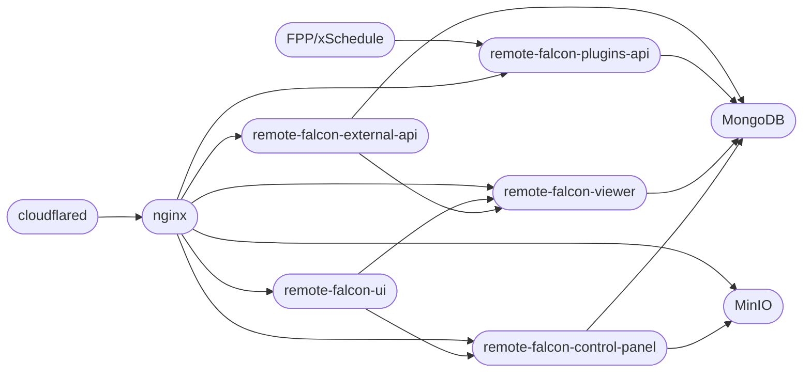

**WORK IN PROGRESS**

Adding a bit to the Remote Falcon architecture diagram from [here](https://docs.remotefalcon.com/docs/developer-docs/how-it-works/architecture), we have Cloudflared and MinIO.

All web traffic goes through [Cloudflared](containers.md#cloudflared){ data-preview } directly into [NGINX](containers.md#nginx){ data-preview }.

Then we also have [MinIO](containers.md#minio){ data-preview } to provide object storage. The [control-panel](containers.md#control-panel){ data-preview } connects directly to MinIO and MinIO is connected to NGINX to allow for images to be viewable on the viewer page.

## cloudflared-remotefalcon flowchart

