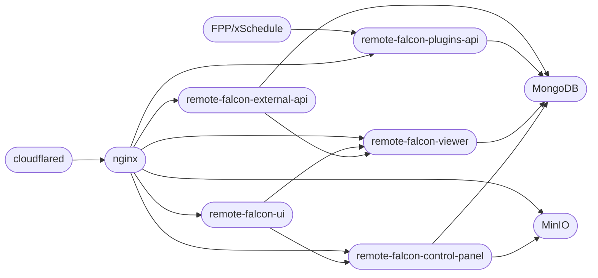

[cloudflared-remotefalcon](https://github.com/Ne0n09/cloudflared-remotefalcon/tree/main) helps you self host [Remote Falcon](https://remotefalcon.com/) through guided setup and configuration using [Cloudflare Tunnels](https://developers.cloudflare.com/cloudflare-one/connections/connect-networks/) and your own server capable of running [Docker](https://www.docker.com/) through the use of various helper [scripts](about/scripts.md).

Ready to get [started](install/index.md)?

Check out the [Remote Falcon Docs](https://docs.remotefalcon.com/) to learn more about Remote Falcon.

## Architecture

Adding a bit to the Remote Falcon architecture diagram from [here](https://docs.remotefalcon.com/docs/developer-docs/how-it-works/architecture), we have Cloudflared and MinIO.

All web traffic goes through [Cloudflared](about/containers.md#cloudflared){ data-preview } directly into [NGINX](about/containers.md#nginx){ data-preview }.

Then we also have [MinIO](about/containers.md#minio){ data-preview } to provide object storage. The [control-panel](about/containers.md#control-panel){ data-preview } connects directly to MinIO and MinIO is connected to NGINX to allow for images to be viewable when used on the viewer page.

### cloudflared-remotefalcon flowchart

