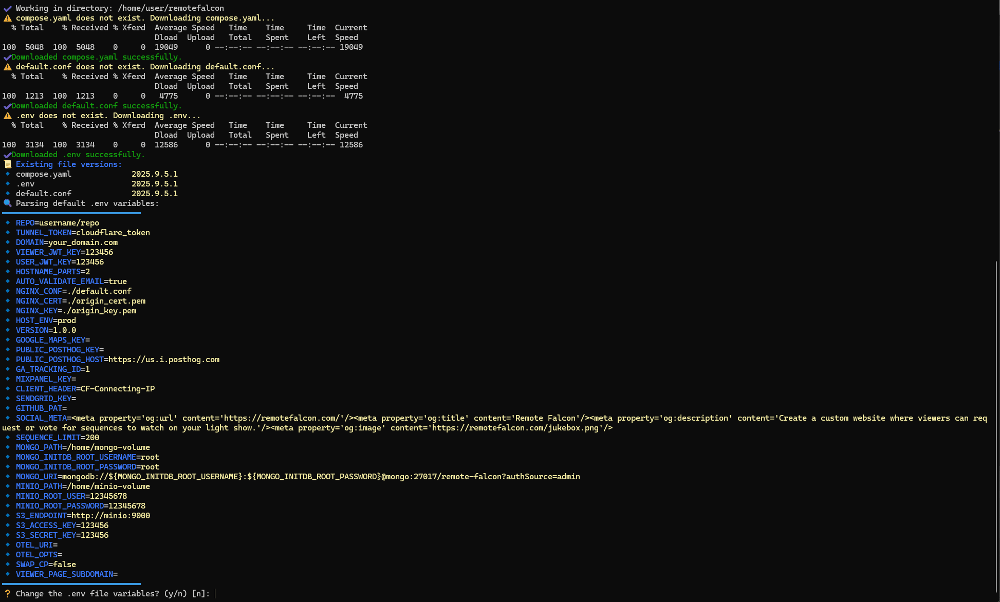

## cloudflared-remotefalcon

[cloudflared-remotefalcon](https://github.com/Ne0n09/cloudflared-remotefalcon/tree/main) helps you self host [Remote Falcon](https://remotefalcon.com/) through guided setup and configuration using [Cloudflare Tunnels](https://developers.cloudflare.com/cloudflare-one/connections/connect-networks/) and your own server capable of running [Docker](https://www.docker.com/) through the use of various helper [scripts](../docs/scripts/).

Are you ready to get [started](main/index.md)?

Check out the [Remote Falcon Docs](https://docs.remotefalcon.com/) to learn more about Remote Falcon.

Release notes for cloudflared-remotefalcon are available [here](release-notes.md).

