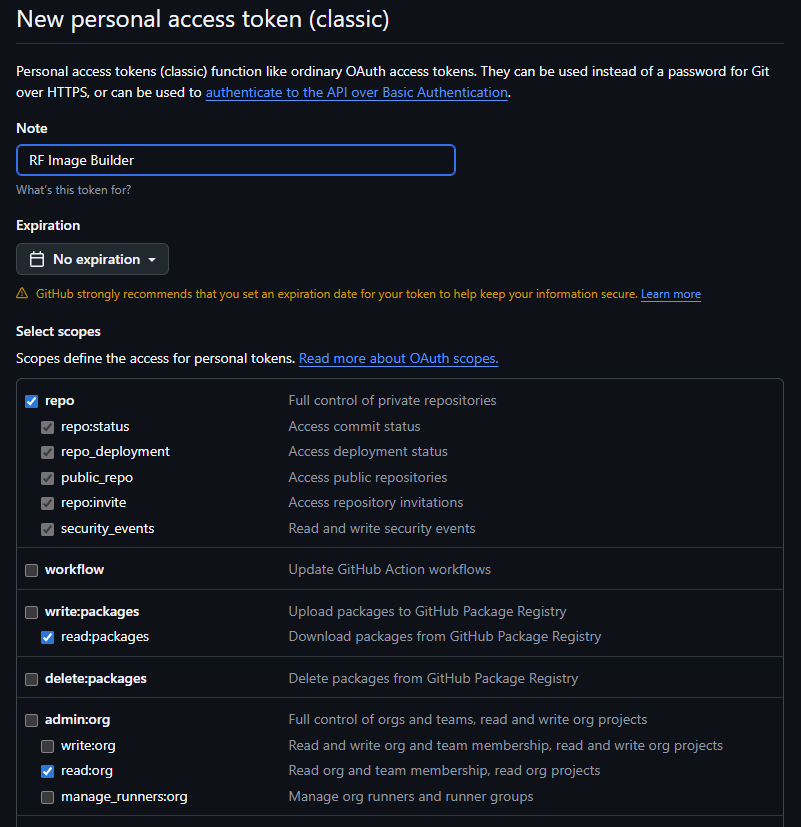

Configure GitHub to remotely build Remote Falcon Images via GitHub Actions workflows.

- This is recommended if you have less than 16 GB of RAM since the plugins-api and viewer images require a lot of RAM to initially build. 

- GitHub will do the heavy lifting of building images while allowing you to run the containers with less RAM.

- The [configure-rf](../about/scripts.md#configure-rfsh) script offers to configure GitHub and create a new private repository to run the [GitHub Actions](https://docs.github.com/en/actions/get-started/understand-github-actions) workflow to build the Remote Falcon Images and push them to [GitHub Container Registry(GHCR)](https://docs.github.com/en/packages/working-with-a-github-packages-registry/working-with-the-container-registry). 

- The private repository is created from the [remote-falcon-image-builder](https://github.com/Ne0n09/remote-falcon-image-builder) template repository which contains the workflows.

- The repository is private so your images that are built with your custom arguments remain private as well.

- This makes use of the [sync_repo_secrets](../about/scripts.md#sync_repo_secretssh) and [run_workflow](../about/scripts.md#run_workflowsh) scripts.

- [sync_repo_secrets](../about/scripts.md#sync_repo_secretssh) syncs build arguments from the [.env](../about/files.md#env) to your private repos as secrets that are used in the workflow to build the images.

- [run_workflow](../about/scripts.md#run_workflowsh) syncs secrets to your repo and runs the [build-all](https://github.com/Ne0n09/remote-falcon-image-builder/blob/main/.github/workflows/build-all.yml) or [build-container](https://github.com/Ne0n09/remote-falcon-image-builder/blob/main/.github/workflows/build-container.yml) workflow.

- [build-all](https://github.com/Ne0n09/remote-falcon-image-builder/blob/main/.github/workflows/build-all.yml) workflow only builds new images if manually run or **if the scheduled run detects new commits from the RF repositories that do not currently exist in GHCR for your repository**.

- [build-all](https://github.com/Ne0n09/remote-falcon-image-builder/blob/main/.github/workflows/build-all.yml) workflow runs daily at 11:00 PM Central Time to check for any new updates from the RF repositories.

- This allows you pull the images when new updates are available, provided your build arguments have remained the same.

## Create GitHub account or sign in to existing account

- Create a new account [here](https://github.com/signup).

!!! note

    The GitHub account is free along with GitHub Actions up to a certain [amount](https://docs.github.com/en/billing/concepts/product-billing/github-actions). 

## Create Personal Access Token

1. Click [this](https://github.com/settings/tokens) link or go to your profile icon on the top right

    - Click :octicons-gear-16: Settings
    - Click :octicons-code-16: Developer settings
    - Click :octicons-key-16: Personal access tokens -> Tokens (classic)

2. Click Generate new token -> [Generate new token (classic)](https://github.com/settings/tokens/new)

3. Enter Note: ```RF Image Builder or similar```

4. Click :octicons-calendar-16: Expiration: Select an expiration date or no expiration

5. Check the following boxes:

    :fontawesome-regular-square-check: **repo**

    :fontawesome-regular-square-check: **read:packages**

    :fontawesome-regular-square-check: **read:org**

6. Click Generate token

7. Click the :material-content-copy: to copy your token and paste it in a notepad

8. Run `configure-rf` and enter `Y` at the question to update GitHub configuration.

