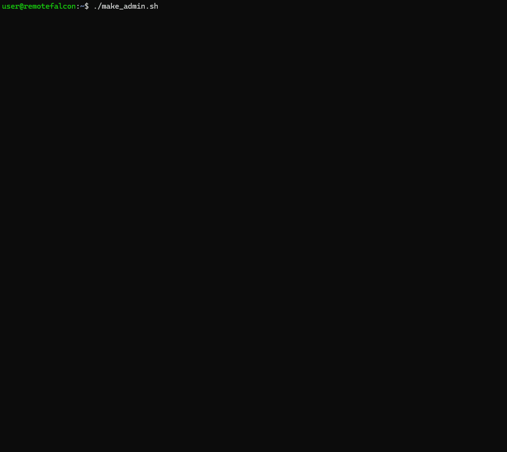

## Script Updates

Currently there is no auto-update for the configure-rf or helper scripts so you may want to check for updates periodically.

1. The `configure-rf` script will print the existing versions on your system when it runs:
```sh
📜 Existing script versions:
🔸 configure-rf.sh           2025.6.2.1
🔸 health_check.sh           2025.5.26.1
🔸 minio_init.sh             2025.5.31.1
🔸 update_containers.sh      2025.5.31.1
🔸 update_rf_containers.sh   2025.5.27.1
```

You can check the [release notes](../release-notes.md) to see if there any updates or view the `.sh` files directly on [GitHub](https://github.com/Ne0n09/cloudflared-remotefalcon) looking for any `# VERSION` comments towards the top of each script.

2. Remove the scripts:
```sh
rm configure-rf.sh shared_functions.sh health_check.sh minio_init.sh update_containers.sh update_rf_containers.sh run_workflow.sh sync_repo_secrets.sh
```

3. The command below will re-download the configure-rf script and run it which will then re-download the helper scripts:
```sh
curl -O https://raw.githubusercontent.com/Ne0n09/cloudflared-remotefalcon/main/configure-rf.sh; \
chmod +x configure-rf.sh; \
./configure-rf.sh
```

    !!! note

        To check for updates to compose.yaml, .env, and default.conf check the instructions [here](../main/updating.md#updating-composeyaml-env-and-defaultconf)

## Scripts Details

Click through the tabs below to view detailed information for each script.

=== "Configure RF"

    - Used for the initial setup and configuration of [cloudflared-remotefalcon](https://github.com/Ne0n09/cloudflared-remotefalcon/tree/main).

    - Guides through setting the required and some optional [.env](../architecture/files.md#env) variables.

    - Can be re-run to view or update the variables or to run the container update or health check scripts.

    - Automatically downloads other helper scripts if they are missing.

    - Automatically creates the `remotefalcon` and `remotefalcon-backups` directories.

    - Automatically downloads the [compose.yaml](../architecture/files.md#composeyaml), [.env](../architecture/files.md#.env), and [default.conf](../architecture/files.md#defaultconf) files if they are missing.

    ```sh title="Run configure-rf.sh"
    ./configure-rf.sh
    ```

    

=== "Update Containers"

    - Checks for updates and updates non-RF containers to their latest available release.

    - Checks for updates and updates Remote Falcon containers to the latest available commit on the [Remote Falcon Github](https://github.com/Remote-Falcon).

    - The [compose.yaml](../architecture/files.md#composeyaml) build context hash is updated to the latest commit for the Remote Falcon containers.
    
    - The compose.yaml container image tag is updated to the latest release.

    - A backup of the compose.yaml is created when any of the containers are updated.

    - The image tag for the Remote Falcon container is updated in the compose.yaml to the short-hash:
    ```yaml linenums="50" hl_lines="3 6"
      plugins-api:
        build:
          context: https://github.com/Remote-Falcon/remote-falcon-plugins-api.git#cc1593aab27dc195a4c55b5b1410ddc06e96a60c
          args:
            - OTEL_OPTS=${OTEL_OPTS}
        image: plugins-api:cc1593a
        container_name: plugins-api
    ```

    - Accepts three arguments:

        1. `[all|mongo|minio|nginx|cloudflared|plugins-api|control-panel|viewer|ui|external-api]`

            - `container_name`: You can specify an individual container or all. If left blank with no other arguments it will check all containers in interactive mode.

        2. `[dry-run|auto-apply|interactive]`: 

            - `dry-run`: Displays if any updates are available or if up to date.

            - `auto-apply`: Automatically update all RF containers if any updates are found.

            - `interactive/no argument`: Display if update is available and prompt for confirmation before updating each container.

        3. `[health]`

            - Add `health` after the first two arguments to automatically run the health_check script.

    ```sh title="update_containers script syntax examples" 
    ./update_containers.sh [all|mongo|minio|nginx|cloudflared|plugins-api|control-panel|viewer|ui|external-api] [dry-run|auto-apply|interactive] [health]
    ./update_containers.sh
    ./update_containers.sh all dry-run health
    ./update_containers.sh all auto-apply
    ```
    

=== "Health Check"

    - Performs a 'health check' of various things and displays any issues that are found.

    - Checks if containers are running.

    - Checks Remote Falcon endpoints.

    - Checks if the domain is not the default.

    - Checks if the [].env](../../architecture/files/#env) file exists.

    - Checks if the Cloudflare Origin certificate and key exist and if they match.

    - Checks NGINX configuration and tests it.

    - Checks various MinIO configuration details for Image Hosting.

    - Checks Mongo to search for any shows that are configured and provides their URL.

    - Checks if [SWAP_CP](../main/post-install.md#swap-viewer-page-subomdain) is enabled and displays the Control Panel URL.

    - Checks for any known issues by checking container logs directly.

    ```sh title="Run health_check.sh" 
    ./health_check.sh
    ```

    

=== "Sync Repo Secrets"

    - If [REPO](../../architecture/files/#env) and [GITHUB_PAT](../../architecture/files/#env) are configured in the .env file this script will sync the build arguments required to build images with GitHub Actions.

    ```sh title="Run sync_repo_secrets.sh" 
    ./sync_repo_secrets.sh
    ```

    

=== "Run Workflow"

    - If [REPO](../../architecture/files/#env) and [GITHUB_PAT](../../architecture/files/#env) are configured in the .env file this script will run a GitHub Actions workflow to build new Remote Falcon Images.
    
    - It will call the sync_repo_secrets script to ensure build arguments are synced prior to building new images.

    - If building all images, expect the workflow to run for about 15 minutes.

    ```sh title="run_workflow script syntax examples" 
    # Usage:./run_workflow.sh [ container | container=sha | container=sha container=sha ...]
    ./run_workflow.sh # Runs the build-all.yml GitHub Actions workflow to build all containers to the latest available commit.
    ./run_workflow.sh [container] # Runs the build-container.yml GitHub Actions workflow to build an individual container to the latest available commit on 'main'.
    ./run_workflow.sh [container=sha] # Runs the build-container.yml GitHub Actions workflow to build an individual container to a specific commit SHA.
    ./run_workflow.sh plugins-api=69c0c53 control-panel=671bbed viewer=060011d ui=245c529 external-api=f7e09fe # Runs the build-all.yml GitHub Actions workflow to build all containers to the specified commit SHAs.
    ```

    

=== "Generate JWT"

    - This is to be able to make use of the External API.

    - Assists with getting your API access token and secret key from your Remote Falcon show in the MongoDB database without having Sendgrid configured for email. 

    - Then the script generates a JWT for you to use.

    ```sh title="Download generate_jwt.sh"
      curl -O https://raw.githubusercontent.com/Ne0n09/cloudflared-remotefalcon/refs/heads/main/generate_jwt.sh; \
      chmod +x generate_jwt.sh
    ```

    ```sh title="Run generate_jwt.sh"
    ./generate_jwt.sh
    ```

    

=== "Make Admin"

    - This script will display shows that have admin access and allow you to toggle admin access when the show subdomain is passed as an argument.

    - Run the script with no arguments to display currently configured showRole(USER/ADMIN).

    - This basically lets you see and edit MongoDB information from within Remote Falcon.

    ```sh title="Download make_admin.sh"
      curl -O https://raw.githubusercontent.com/Ne0n09/cloudflared-remotefalcon/refs/heads/main/make_admin.sh; \
      chmod +x make_admin.sh
    ```

    ```sh title="Run make_admin.sh"
    ./make_admin.sh
    ```

    

=== "Revert"

    - This script will allow you to revert to a previous backup of the .env, compose.yaml, or MongoDB.

    - The script looks for backups in the 'remotefalcon-backups' directory.

    ```sh title="Download revert.sh"
      curl -O https://raw.githubusercontent.com/Ne0n09/cloudflared-remotefalcon/refs/heads/main/revert.sh; \
      chmod +x revert.sh
    ```

    ```sh title="Run revert.sh"
    ./revert.sh
    ```

    

=== "MinIO Init"

    - This script will configure MinIO. Minio is a lightweight object storage server.

    - The script is called when 'configure-rf.sh' is run and if certain default values are found in the .env file for a hands-off setup and configuration.

    - The minio container is configured for local direct access to the control-panel container.

    - This lets you use the Image Hosting tab in the Control Panel which allows you to self host your viewer page images.

    - The script can be run again manually with no ill-effects to ensure MinIO is configured properly.

    - The script is automatically downloaded by configure-rf.

    

=== "Shared Functions"

    - This is a helper script for functions and variables that are re-used across the other scripts. 